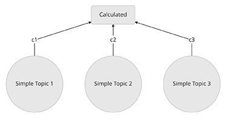
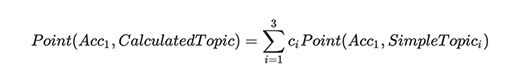
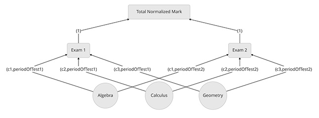

# What the ... (!) is Abaci? 

Abaci is a high-performance score and rank calculation engine.

1. [Introduction](#introduction)
   - [What is score? What is rank?!](#what-is-score-what-is-rank)
   - [It seems very simple! Do I need it?](#it-seems-very-simple-do-i-need-it)
   - [What does it calculate?](#what-does-it-calculate)
2. [Building blocks](#building-blocks)
   - [Topic](#topic)
     - [Simple Topic](#1-simple-topic)
     - [Calculated Topic](#2-calculated-topic)
     - [Time-based topic](#3-time-based-topic)
   - [Leaderboard](#leaderboard)
3. [Sample Scenario](#sample-scenario)

## Introduction

### What is score? What is rank?!

Think of a tournament, in which each *player* has to pass a series of *matches* and the *points* that he earned is registered somewhere to determine his overall `rank` among all participated players.

Here we use score and points interchangeably, but inside `Abaci` , `Point` is used to denoted the score of a participant.

Now, during the period of the tournament, each player earns different points and so his rank (and the others' rank) changes. `Abaci` in its simplest form is all about registering some points for a participant and calculate the ranks of all participants in real-time.

### It seems very simple! Do I need it?

If all you need is determining the rank of players in the simple scenario, which was presented in the previous part, then you maybe don't need to bother with the overhead of a bunch of API calls and of course a learning-curve.

But for a moment, suppose the number of players become more than *ten thousands*! Think of the processing power, which is needed to *sort* the ranks *every time* you add a point to a player.

 Up to now, we supposed that all the matches have the same role, when contributing to the rank of participants. But, what if each match has its own value and the points, which earned in a match should be calculated differently than the other matches.

To make things worse, let's impose another constrain: each match has a `validity period` and beyond that, no points should be accepted for any player on that match.

If these scenarios sounds familiar, then `Abaci` is for you!

### What does it calculate?

`Abaci` generalized the concept of a **match** into something that can accept point for some **subjects** in a way to determine the **rank** of subjects in its context.

To support the scenarios, in which *matches* have different properties and values, `Abaci` introduced *virtual matches*, which get their per-participant points from the *real* matches but apply some kind of formula to get the actual match-weighted points.

This *virtual matches* can be established in a way that consume more than one *real matches* to calculate weighted points. So why stop here? There could be other *para-virtual-matches* based on the level 1 *virtual matches* and so on; We are constructing a **hierarchy**!

When looking at this *hierarchy* it's apparent that we need a more abstract term than *match* to encompass completely different scenarios with the same requirement of *point-calculation* and *rank-extraction*.

This is how `Abaci` was born!

## Building blocks

The generalization of the **match** concept in `Abaci` is called `Topic`. It is a context, in which `subjects` can *earn* (or *lose*) `points` and their `ranks` are important.

In `Abaci` subjects are denoted by `account-id`.

A `topic` can be **simple** or **calculated**; And a *calculated* `topic` can have a **validity period**.

`Topic` ,`Leaderboard` and `account-id` are the building blocks of `Abaci`.

### Topic

Whenever we want to register points of subjects and then determine their ranks in a particular context, a `topic` should be created. `Abaci` have these kinds of `topics`:

#### 1. Simple Topic

A `simple topic` is the basic entity, which can accept `points`. A topic has a broad domain, from a specific *match* to *school test* or an *advertising campaign*; in which we want to offer bonus to users who become member. A `topic` can also be a resource, which we want to bill users based on their usage; In this case the unit of usage are `points`.

If the **hierarchy** of topics is represented as a tree, then `simple topics` form the **leaf nodes**.

#### 2. Calculated Topic

A `calculated topic` is the **parent** of one or more `simple topic`, which its points is automatically calculated based on its children and its `formula`. In the current version, the `formula` is a *polynomial*, which its *variables* are the child topics and its *coefficients* is recorded inside the data model of the parent `calculated nodes`.

In the *tree* analogy, a calculated topic is a parent node, which has weights on its edges that connect it to its children. These weights are the *coefficients* of its `formula`.

In this diagram c1,c2 and c3 are *coefficients* of the formula, so the point (*score*) of `account 1` in `calculated` topic node is computed according to this formula:

It's clear that a `point` can't be added to a `calculated topic` directly.

#### 3. Time-based topic

A `time-based topic` is a topic (*simple* or *calculated*), which has a **validity period**. This kind of topic can accept (or calculate) points only during that period of time and when it is expired, it can't be found ever. :astonished:

 ### Leaderboard

Although, `Abaci` doesn't currently has a `leaderboard` object, but whenever the ranks of a bunch of `accounts` is calculated, actually we have of kind of `leaderboard`.

`Abaci` contains API's for querying the rank of a single account or an array of accounts. These API's are grouped under the title of `Leaderboard`.

## Sample Scenario

To make these abstract ideas more concreate, let's have a sample scenario. Let's in a high-school, we want to evaluate the educational progress of students. There are multiple examination period in the school, in which a series of examination for all courses takes place. To consider the difficulty and importance of each course, the earned raw mark of each course should be multiplied by a specific factor. The sum of the normalized mark over all courses gives the total normalized mark of that student.

We want to calculate the normalized mark of each student, besides his/her rank among all other students over each examination period and also over all exams.

It's clear that for each course, we should have a simple topic. To apply the course-mark-factors, we need a calculated topic, which is the parent of all courses and have a formula with the coefficient of the course factors. Moreover, since each examination has a specific period, a time-base rule is required to guarantee that the marks go to their corresponding exam. In this way, we can determine the rank of each student in each course and in each examination.

Finally, since ranks over all exams are needed, we put another calculated topic as the parent of the exams topics. Here is the proposed topic graph for this scenario:

The labels over the edges indicates the coefficients and time-rules of the parent-child relation. 
